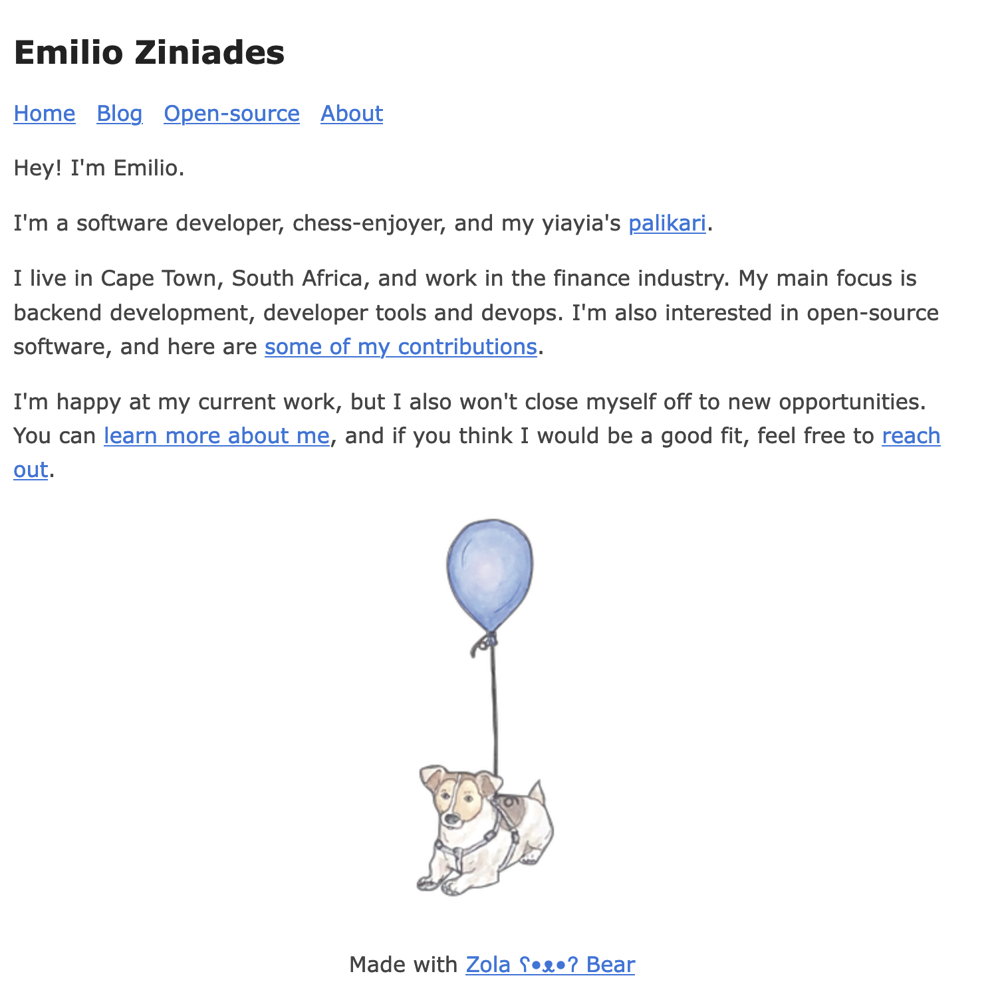

# [emilio.co.za](https://emilio.co.za)



A personal website built with [Zola](https://getzola.org), using the [zola-bearblog](https://codeberg.org/alanpearce/zola-bearblog/) theme.

## Development

```bash
# enter into a development shell with zola binary
nix develop

# run local development server
zola serve --drafts

# check links
zola check

# build
zola build
```
