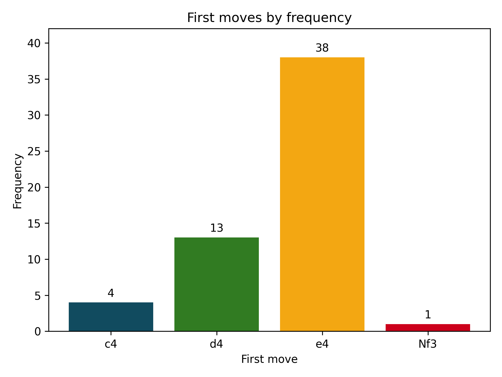
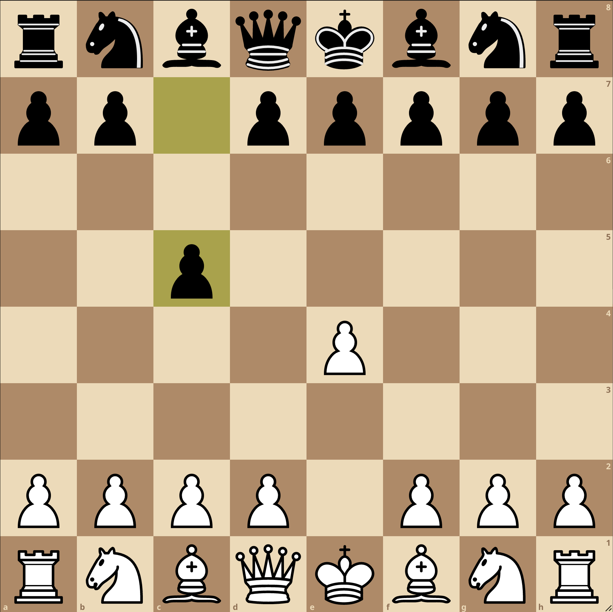
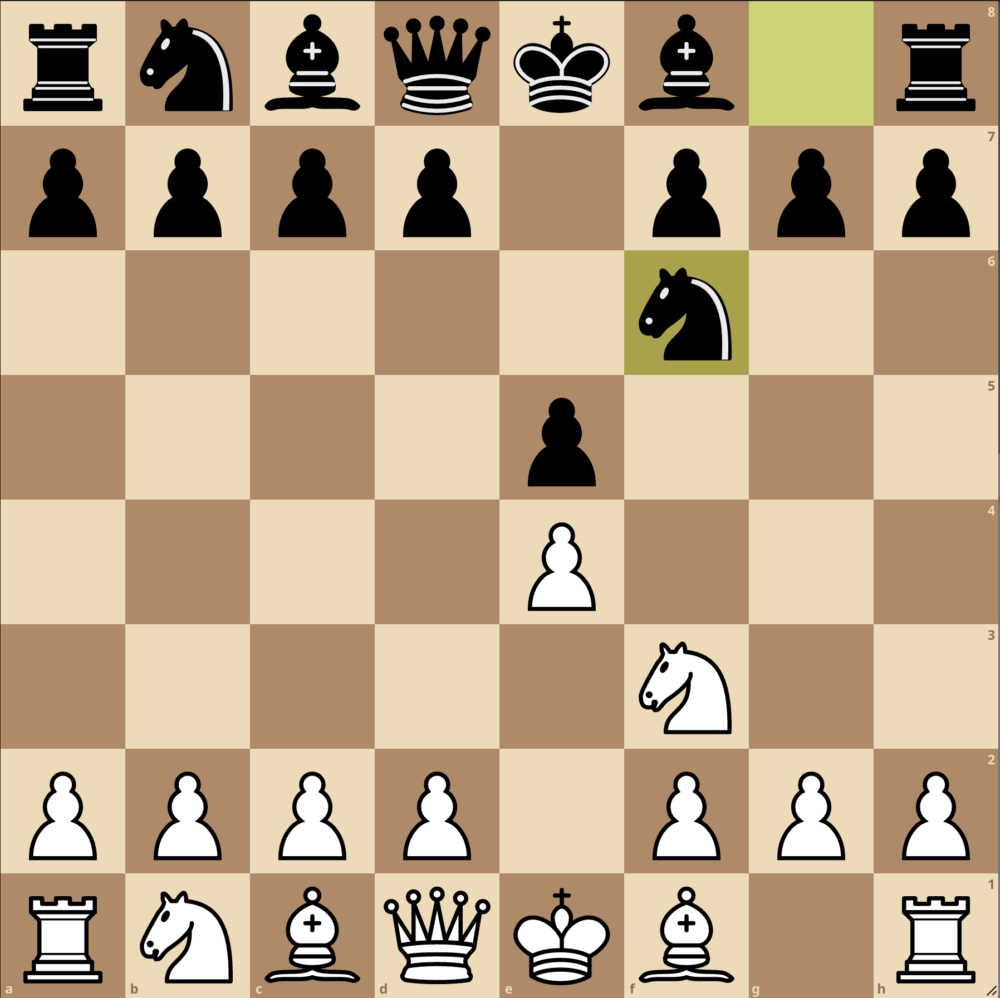

+++
title = "Candidates 2022: Opening Analysis"
date = "2022-07-22"
description = "An analysis of the chess openings used in the FIDE 2022 Candidates Tournament."
+++

## Introduction

In order to challenge for the World Chess Champion title, you need to win the Candidates Tournament.
The top eight chess players, having qualified via various elite-level tournaments, battle it out in a double round-robin.
Over the course of fourteen gruelling days each player plays everyone else twice: once with the black pieces and once with the white pieces.

Because of the high-stakes nature of the tournament, nothing is held back in terms of opening preparation.
Usually, in the modern era of chess driven by engine-backed analysis, players are careful about revealing their opening preparation.
All games are available online immediately after they are played and so any novelty you play will be immediately be studied, re-analysed, and disarmed.
The elite-level grandmasters are thus careful about revealing their hand.

This is the case for most tournaments, but not for the Candidates Tournament.
To be able to challenge for the World Champion title is the pinnacle of chess and so players will throw their entire book (or laptop) at this tournament, trying out all the new ideas that they have carefully cultivated leading up to it.
It can be considered the state of the art in terms of opening theory.

The 2022 Candidates Tournament took place in Madrid, Spain from 16 June to 5 July.
This post will analyse the range of openings used over the course of all 56 games, summarize which were used the most frequently, and evaluate how well they fared.
The code is available [here](https://github.com/emilioziniades/candidates-2022-openings). All code was written in Python, and the dataset of games was downloaded from [Lichess](https://lichess.org).

## The First Move

A sensible place to start is to consider the first move of the game.
There are 20 legal first moves in chess, but these elite players settled for only 4 of them.
The chart below shows which were most common.

The move _1. e4_ made up the bulk of games.
It comprised two-thirds of all games played, more than all the other first moves combined.
These players are here to win, and _1. e4_ is known to lead to much sharper positions, with lots of winning opportunities for both sides.
The alternatives, particularly _1. c4_ and _1. d4,_ are known to be more positional openings with longer-term plans.

As a visual guide, I have included a board with arrows indicating these moves, where the colours correspond to the chart above.

Each of these first moves leads to a variety of different openings, which I consider in the following section.

## Opening Weapons Chosen

Beyond the first move, we can investigate the specific openings which were used most frequently.
The second chart below shows how often each opening was used.
The openings are grouped by the first move, and the colours correspond to the first chart so that it is clear to see which first moves lead to which openings.

I refer to these as opening categories, because each of the openings named in the chart above has multiple sub-variations within them.
The Sicilian Defense, for example, can be divided into many variations: Najdorf, Scheveningen, Sveshnikov, Dragon, Alapin, Rossolimo, Taimanov, Richter-Rauzer, Grand Prix Attack, and so on.
Because the sample size was relatively small, only 56 games, it makes sense to group these families of openings into overarching categories.

Within the _1. e4_ openings, the Ruy Lopez and the Sicilian Defense were the most commonly used.
These two openings alone comprised just under half of all games played.
In _1. d4_, the Catalan Opening was the preferred weapon.

## Evaluating Opening Performance

In addition to counting the frequency of each opening, I was interested in seeing how well they performed.
The third chart below summarizes the performance of each opening, indicating the percentages of wins with white, draws, and wins with black.
The number of games played in that opening are indicated in brackets.

In total, 59% of all games were drawn.
This is not a surprise, especially at the highest level where there is little difference in skill level between players.
It is said that, chess, when played correctly, is a drawn game.
White won slightly more games than black.
This is to be expected, as the privilege of moving first confers a significant advantage to the white player.

There is a fine balance between going for solid positions, and taking risks.
Taking risk means going for possibly winnable positions but which also give your opponent the opportunity to seize a victory themselves.

In a tournament like the Candidates, where only first place matters, players must find the balance between keeping pace by accumulating draws, and gaining victories which put you ahead of the pack.

One example of risk-taking in chess is exemplified by the Sicilian Defense.
It is an immensely complicated opening, with hundreds of move trees branching out from the starting position, _1. e4 c5_.
It is sharp and tactical, whilst still leading to intricately strategic middlegames.
Right from the first move, black creates imbalance, and tries to convert this imbalance into a victory.
However, it seems like this was unsuccessful.
Black was unable to win a single game utilizing the Sicilian. Two thirds of Sicilian games were drawn, and the other third won by white.

_The Sicilian Defense_

By contrast, the Russian Game, also known as the Petrov Defense, (characterized by _1. e4 e5 2. Nf3 Nf6_) seemed like a better choice for the black player.
In all six Petrov games, white was unable to win. Black won a third of these games, and the other two thirds were drawn.
Ian Nepomniachtchi, the tournament winner and next World Champion Challenger, utilized this defense in all of his games with black when faced with _1. e4_.

_The Russian Game_

The Catalan Opening and the Italian Opening are two examples of solid, positional openings which have very little risk.
And in both cases, 80% of games were drawn.
Half-points are necessary to keep up with the rest of the field, but fourteen draws will not secure your ticket to the next World Championship match.

The Ruy Lopez was the opening which led to the most decisive results.
Only 30% of Ruy Lopez games were drawn.
70% of games were decisive, with white taking a slight edge, winning 40% of games, compared to black's 30%.
Clearly, the choice to play the Ruy Lopez, also known as the Spanish, which begins after _1. e4 e5 2. Nf3 Nc6 3. Bb5_, was a double edged decision. You give yourself the chance to win, which also means the possibility of losing.

_The Ruy Lopez_

## Conclusion

The openings you choose to play are as important as your ability to navigate complex middlegames and your technique in endgames.
The branches of possible chess games are unfathomably massive, but by choosing the correct opening, you can guide the game into a territory with which you are familiar, and where your opponent is uncomfortable.
To quote Mikhal Tal, the eighth World Chess Champion,

> “You must take your opponent into a deep dark forest where 2+2=5, and the path leading out is only wide enough for one.” - Mikhal Tal

The Candidates Tournament is the most prestigious tournament in all of chess, as its winner earns the right to challenge the current World Champion.
Players study months in advance, saving their sharpest weapons for the event.
This short post was an attempt to summarize, at a high level, which openings players chose, and how effective they were.

_Addendum: The incumbent World Champion, Magnus Carlsen, has [declined to defend his title](https://chess24.com/en/read/news/magnus-carlsen-to-give-up-world-championship-title) next year.
Instead, the winner of the candidates, Ian Nepomniachtchi, will battle against the runner-up, Ding Liren, for the title of World Champion in 2023._
