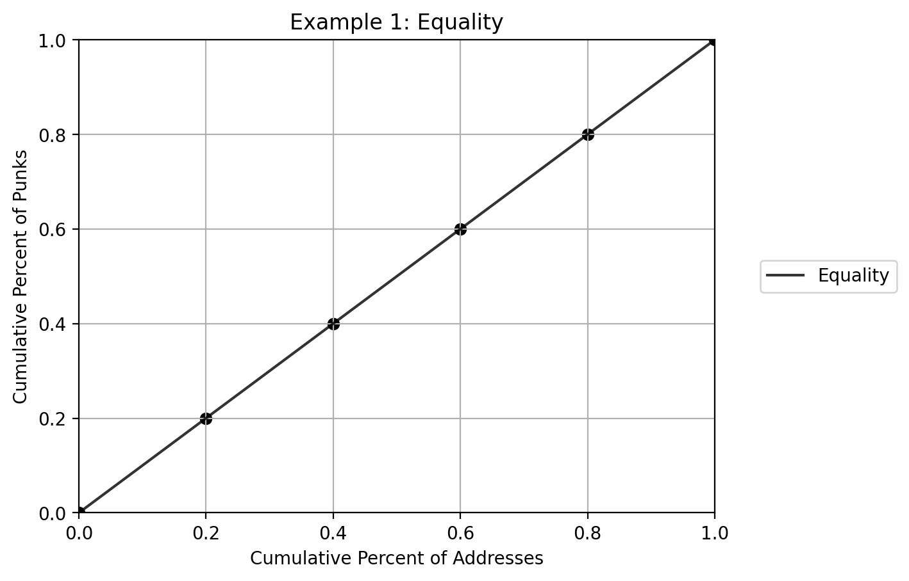
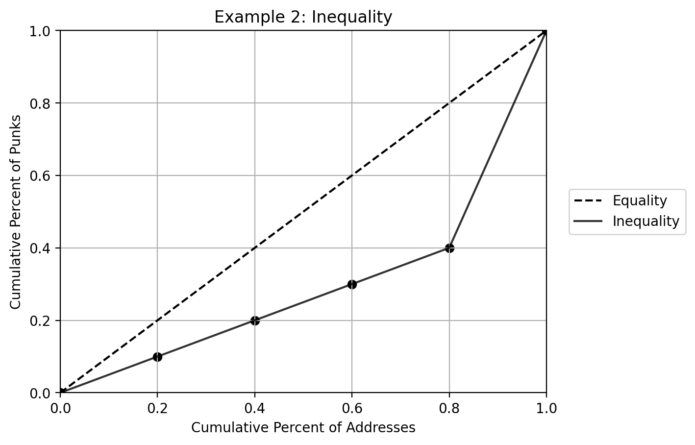

This technical write-up elaborates on some of the more detailed aspects of the research project discussed in [this paper](@/blog/cryptopunks/index.md).

## CryptoPunks

### Where exactly do the images live?

It is worth noting that the actual images of the Punks are not stored on-chain. The full image of all Punks is 828KB, and it would be prohibitively expensive to store this on the Ethereum blockchain.

Instead of storing the raw images on-chain, most NFT projects today store the images somewhere else online (either at a certain URL or possibly on [IPFS](https://www.ipfs.io/)), and simply include the link to that image within the transaction metadata.

I have some concerns about this. The internet, and the links that comprise it, are not a stable landscape, but rather a fluid and dynamic one. Always shifting, changing, and even [rotting](https://www.theatlantic.com/technology/archive/2021/06/the-internet-is-a-collective-hallucination/619320/). It is possible that one day the URLs referred to on-chain will be nothing more than broken links.

In any case, the CryptoPunks creators also opted to avoid storing the images themselves on-chain. Instead, the smart contract contains the [sha256 hash](https://github.com/larvalabs/cryptopunks/blob/11532167fa705ced569fc3206df0484f9027e1ee/contracts/CryptoPunksMarket.sol#L5) of the image. So given this hash, which is stored immutably on-chain, one can very that an image represents the authentic CryptoPunks collection by hashing the image and comparing that hash to the one in the smart contract. If the hashes are the same, then you can find the verified and geniune picture of your Punk by counting from left to right, top to bottom, starting at 0. This works as long as one can access the image _somewhere_ online.

### Events

In order for third party applications to keep track of the CryptoPunks market, the smart contract broadcasts events when certain actions occur. So there is a `PunkBought` event, as well as a `PunkTransfer` event. These events are stored in the blockchain, and so they are immutable and verifiable in the same way that transactions are. This allows NFT marketplaces such as [Opensea](https://opensea.io/) to keep track of NFT ownership by subscribing to these events. It also allows researchers like myself to collect data on the status of the CryptoPunks market.

Given the initial state of the CryptoPunks marketplace, and all the broadcasted events, one can effectively replay history, by querying an Ethereum node for the emitted events broadcast up until a certain time. This is pretty cool. It means that not only can we check exactly which address own which Punks, but we can do so at every moment in time since the smart contract is deployed.

The ERC721 standard defines certain events that any NFT smart contract must broadcast in order to adhere to the standard. This includes the `Transfer` event, which is broadcast whenever an NFT is claimed, sold or transfered without sale. This event should include the to and from addresses, as well as the index number of the NFT. The smart contract could include additional events that specify more information, such as the sale price.

Since CryptoPunks was deployed a whole year before the ERC721 standard was finalized, it does contain some idiosyncrasies in terms of the events it broadcasts. Although it includes a `Transfer` event, which is broadcast when a Punk is either transferred or bought, it also includes `PunkTransfer` and `PunkBought` events, which are broadcast only when a Punk is transfered or bought respectively. `PunkBought` mentions the sale price, whereas `Transfer` does not.

#### Snags

Initially, I thought that using `Transfer`, `PunkTransfer` and `PunkBought` alone would be enough to gather the required information. But due to a [bug in the smart contract](https://github.com/larvalabs/cryptoPunks/issues/19), certain `PunkBought` events broadcast the price as 0 ETH, and the recipient address as 0x0. This bug does not affect the functioning of the market for CryptoPunks itself, but only the accuracy of the information broadcasted via events. This required a non-trivial amount of effort to address. Firstly, the recipient address could be determined from the corresponding `Transfer` event. But since this event does not mention the price, one has to obtain the sale price from the value of the most recent bid on the Punk from the person who eventually bought it, which meant also fetching logs for the `PunkBidEntered` and `PunkBidWithdrawn` events. The Github issue linked above covers this problem in more detail. Overall, 3600 RPC calls were made to the Ethereum node to gather all the required data.

Once the above issues were resolved, I was able to assemble a chronological list of events broadcast by the smart contract, and implemented some accounting logic to keep track of Punk ownership and sale prices.

Beyond the problems mentioned above, there were also some manual changes I had to hard-code.

Firstly, there was the [half a billion dollar sale of Punk 9998](https://twitter.com/larvalabs/status/1453903818308083720) which, if legitimate, would have been the highest price paid for a Punk by far. However, as the linked tweet above discusses, this sale was not legitimate. In fact, the owner of this Punk sold 9998 to himself using two addresses both under his control. The money was borrowed and repaid within the same transaction via a [flash loan](https://ethereumprice.org/guides/article/flash-loans-what-are-they-and-how-do-they-work/). Presumably, the intention was to artificially increase the perceived value of 9998. If included in the analysis, this would have skewed the results heavily. Since it is not a legitimate transaction, I have omitted it from the dataset.

In addition, there are some addresses which do not represent individuals, but rather represent other smart contracts, which provide some additional functionality. [Wrapped Punks](https://www.larvalabs.com/cryptoPunks/accountinfo?account=0xb7f7f6c52f2e2fdb1963eab30438024864c313f6) provides a wrapper for CryptoPunks which allows them to function as bona fide ERC721 tokens. [Punks OTC](https://www.larvalabs.com/cryptoPunks/accountinfo?account=0x6639c089adfba8bb9968da643c6be208a70d6daa) provides an over the counter service, where Punks are traded via direct negotiation between buyers and sellers, instead of openly in the market. Finally, this [smart contract](https://www.larvalabs.com/cryptoPunks/accountinfo?account=0x2cc12318de28edc9c753f7cb22100890af630c2d) owns 44 Punks, and paid exactly 0 ETH in total for them. Not sure exactly what is going on here to be honest. I have made an effort to omit these from the study, since they do not represent individual people holding CryptoPunks. Further research could refine the work done here by determining what happens to the the Punks that are transferred to these other smart contracts.

## Inequality

Here, I lay out in depth the foundations of Lorenz curves and Gini coefficients, which are the basis of my analysis. Both are ways of quantifying inequality.

### Lorenz curve

Let's assume there are only 10 Punks and 5 people, and that each person owns exactly 2 Punks, and so the Punks are equally distributed. The following situation could be described by this table.

| Person | Share of all people | **Cumulative share of people** | Punks owned | Share of all Punks | **Cumulative share of Punks** |
| ------ | ------------------- | ------------------------------ | ----------- | ------------------ | ----------------------------- |
| 1      | 0.2                 | **0.2**                        | 2           | 0.2                | **0.2**                       |
| 2      | 0.2                 | **0.4**                        | 2           | 0.2                | **0.4**                       |
| 3      | 0.2                 | **0.6**                        | 2           | 0.2                | **0.6**                       |
| 4      | 0.2                 | **0.8**                        | 2           | 0.2                | **0.8**                       |
| 5      | 0.2                 | **1.0**                        | 2           | 0.2                | **1.0**                       |

Focus on the two colums in bold. Since at every point, the cumulative share of people is equal to the cumulative share of Punks, this scenario describes the equal distribution of Punks. In Example 1, I have plotted _cumulative share of people_ vs _cumulative share of Punks_.



In Economic jargon, this is called a Lorenz curve. It graphically represent income or wealth (or Punks) distribution. It isn't actually curved yet, because we have graphed the situation of perfect equality. Consider a more unequal scenario: There are still 10 Punks and 5 people, but one person has 6 Punks, and everyone else only has 1 Punk. As a table, that would look like this.

| Person | Share of all people | **Cumulative share of people** | Punks owned | Share of all Punks | **Cumulative share of Punks** |
| ------ | ------------------- | ------------------------------ | ----------- | ------------------ | ----------------------------- |
| 1      | 0.2                 | **0.2**                        | 1           | 0.1                | **0.1**                       |
| 2      | 0.2                 | **0.4**                        | 1           | 0.1                | **0.2**                       |
| 3      | 0.2                 | **0.6**                        | 1           | 0.1                | **0.3**                       |
| 4      | 0.2                 | **0.8**                        | 1           | 0.1                | **0.4**                       |
| 5      | 0.2                 | **1.0**                        | 6           | 0.6                | **1.0**                       |

Importantly, we have sorted the table from lowest number of Punks owned to highest number of Punks owned. Here, the bottom 80% of people own only 40% of all Punks. The Lorenz Curve for this scenario is pictured in Example 2.



As you can see, situations of inequality are graphically described by deviations from the dashed diagonal line representing equality. The more unequal the distribution, the further away the Lorenz Curve is from the line of equality.

### Gini coefficient

But how do we quantify exactly how far away the Lorenz curve is from the line of equality? Let's look at the Lorenz curve from Example 2, and shade the region between the line of equality and the Lorenz curve in red, and the region between the Lorenz curve and the x-axis in blue.


As the Lorenz curve moves further away from the line of equality, the red region grows bigger, and the blue region grows smaller. We can represent the degree of inequality as _the fraction of the red area over the sum of the red and blue areas_. As a formula,

```
degree of inequality = red / (red + blue)
```

We call this 'degree of inequality' the Gini coefficient. There is a more rigorous formula, which you can see on the [Wikipedia page](https://en.wikipedia.org/wiki/Gini_coefficient) and which I use to calculate the values in my analysis. But I find this graphical interpretation to be far more intutive, and it suffices for the sake of this post.

Consider the two extreme cases.

In the case of perfect equality, there is no red region, so the the Gini coefficient is just `0 / (0 + blue) = 0`. On the other hand, in the situation of perfect inequality, where one person owns absolutely everything and everyone else owns nothing, there is no blue region, so the Gini coefficient is `red / (red + 0) = 1`. Realistically, the Gini coefficient will tend to 1, but will never actually reach it in practice. So the Gini coefficient ranges from 0 to 1. Figures near 0 describe roughly equal distributions, whereas figures near 1 describe unequal distributions. If you calculate the Gini coefficient for Example 2 above, you get 0.40, (or 40%).

For context, the [World Bank](https://data.worldbank.org/indicator/SI.POV.GINI) calculated that South Africa, one of the most economically unequal countries in the world, had a Gini coefficient of 0.63 (or 63%) in 2014, whereas the Gini coefficient of Iceland was 0.26 (or 26%) in 2017, making it one of the least unequal countries in the world.
