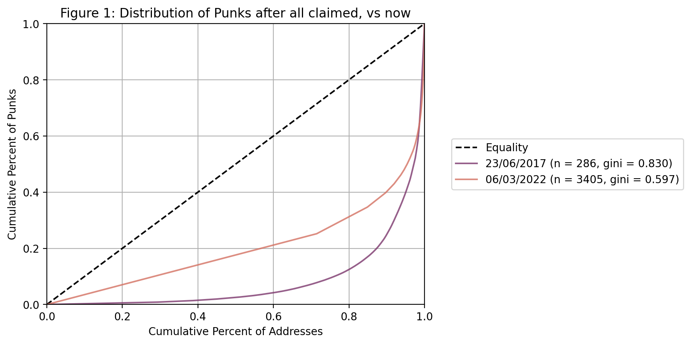
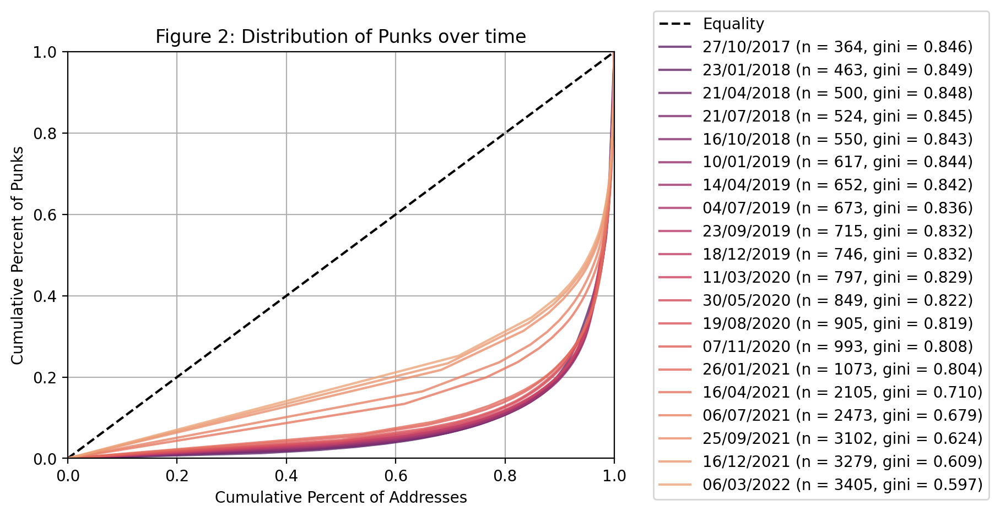

+++
title = "CryptoPunks, Inequality and Economic Research on the Blockchain"
date = "2022-03-08"
description = "On conducting economic research on blockchains, with a CryptoPunks case study."
+++

## Introduction

CryptoPunks are widely considered to be the first NFT project on the Ethereum blockchain. I set out to answer the question: how are these NFTs distributed across their owners?

This post will first briefly introduce CryptoPunks and NFTs. It then measures the distribution of CryptoPunks over time, deriving [Lorenz curves](https://en.wikipedia.org/wiki/Lorenz_curve) and [Gini coefficients](https://en.wikipedia.org/wiki/Gini_coefficient) as a measure of inequality of Punks (and the Ether value of those Punks).
Finally, it considers, in general, the prospects for conducting economic research on blockchains.

I have written a [technical explainer](@/blog/cryptopunks-technical/index.md) as a companion to this post, which goes into more depth on certain topics.

## CryptoPunks

_Image Source: [CryptoPunks website](https://www.larvalabs.com/public/images/product/cryptopunks/punk-variety-2x.png)_

[CryptoPunks](https://www.larvalabs.com/cryptopunks) is an Ethereum Non-Fungible Token (NFT) project by Larva Labs, which consists of 10,000 pixel art characters like the ones above. They were programatically generated to have a combination of different traits, such as hats, hair colour and earrings. Punks are indexed from 0 to 9999. One can see all the Punks in [this image](https://github.com/larvalabs/cryptoPunks/blob/master/punks.png).
Each individual Punk represents a single token, and each token is unique (i.e. non-fungible). The ownership of these Punks is mediated by the [CryptoPunks smart contract](https://github.com/larvalabs/cryptoPunks/blob/master/contracts/CryptoPunksMarket.sol) which was [deployed](https://etherscan.io/address/0xb47e3cd837dDF8e4c57F05d70Ab865de6e193BBB) in June 2017.
Actually this was the second version of the smart contract. The first had a fatal [bug](https://twitter.com/0xfoobar/status/1374604091263905794?s=21) - but we won't be getting into any of that today.

The smart contract mediates all ownership, purchase and transferal of Punks. It keeps track of which addresses own which Punks, whether there are any active bids on any Punks, and stores funds received from sales of Punks, which can then be withdrawn to a user's address. It is essentially a fully automatic marketplace, whose rules are described by the code in the smart contract.

When the contract was deployed, all 10,000 Punks were up for grabs. For free, you could claim a Punk, only paying the gas fee associated with updating the state of the smart contract. After all Punks were assigned, you could either transfer your Punk to someone else for free, put in an offer to buy someone else's Punk, or you could put your own Punk up for sale at a specified price.
In order to take part, all you had to do is interact with the smart contract.

The project served as one of the sources of inspiration for the [ERC721 standard](https://eips.ethereum.org/EIPS/eip-721) used by every NFT project today, which standardizes NFT marketplaces.
The smart contract was deployed in 2017, a year before ERC721 was finalized.
This meant that interacting with the CryptoPunks smart contract programatically required some tinkering.

## Inequality

The remainder of this paper tackles the research question: what is the distribution of CryptoPunks? Are they equally distributed among many addresses, or do a few addresses own most of the Punks? And how does the distribution of Punks change over time? Does it disperse over time, or does it concentrate? Also, not all Punks are equally valuable. Some Punks are sold for [millions of dollars](https://www.larvalabs.com/cryptopunks/details/5822), whilst other Punks sell for less. So I then consider how the ETH value of Punks is distributed across all Punk owners.

I make use of two economic concepts to conduct this analysis: Lorenz curves and Gini coefficients. For more information, see the [technical explainer](@/blog/cryptopunks-technical/index.md).

Lorenz curves represent inequality graphically. They graph the cumulative percent of people versus the cumulative percent of resources. If resources were distributed equally, the Lorenz Curve would represent a diagonal line going through the origin and (1, 1). The further away the curve is from that diagonal line, the more unequal the market.

Gini coefficients quantify inequality as a single number between 0 and 1. Coefficients close to 0 indicate more equal distributions, while coefficients near 1 indicate highly unequal distributions.

### The distribution of CryptoPunks over time

My tool of choice for gathering, processing and graphing the data was Python. All the code for this project can be found on [Github](https://github.com/emilioziniades/punks-analysis).

#### Fetching and cleaning the data

Using `web3py`, a popular Python library for interacting with the Ethereum network, I connected to an Ethereum node via [Infura](https://infura.io/) and queried it for all the events broadcast by the CryptoPunks smart contract, from the time the contract was deployed in June 2017, until 12AM on the 7th of March 2022. The aim was to determine which addresses owned which CryptoPunks, and at what price each Punk was last sold for.

Again, it must be emphasized that there are two distinct distributions to consider. 1) The distribution of actual Punks and 2) the distribution of the ETH value of those Punks, as represented by the most recent sale price. I will discuss both below.

#### Results

Figure 1 shows the distribution of Punks, as represented by Lorenz curves, at two distinct points in time: in 2017 after all Punks had been claimed by their initial owners, and in March 2022.

The main conclusion to be drawn here is that the distribution of Punks actually became more equal over time. Initially, after all Punks had been claimed, the Gini coefficient was 0.83. Looking at the blue line, the bottom 80% of Punk owners owned just over 10% of all Punks. Five years later, in March 2022, the Gini coefficient dropped to 0.597. This is still very unequal though, and considering the red line, you can see that the bottom 80% of Punk owners still only owned roughly 30% of all Punks. So, in scientific terms, the CryptoPunks market changed from being _very unequal_, to being _just slightly more equal but still quite unequal_.

Figure 2 below shows a more gradual change in distribution. It has the same start and end points as Figure 1, but it includes 18 other intermediate points spaced approximately 4 months apart. The line colours form a gradient from blue to orange. Blue lines occured further in the past, and orange lines occured more recently. There was a noticeable jump that occured around April 2021. This is roughly in the period when the world was in the midst of a fervent NFT mania, just a month after the record breaking [auction](https://www.theverge.com/2021/3/11/22325054/beeple-christies-nft-sale-cost-everydays-69-million) of Beeple's The First 5000 Days at Christies. This booming NFT market has some similarities to the ICO (Initial Coin Offering) [boom of 2017](https://www.forbes.com/sites/jeffkauflin/2018/10/29/where-did-the-money-go-inside-the-big-crypto-icos-of-2017/?sh=5e1e5fd7261b). Interestingly, the Gini coefficient goes down during this period. This also corresponds with a doubling in the number of addresses that hold Punks, from 1073 in January 2021 to 2105 in April 2021.

So far, I have only discussed the distribution of Punks tokens among addresses. Really, one shouldn't weight each Punk equally, since there is a large degree of variation in the prices that they are sold for. So, instead of considering the distribution of Punks themselves, one could consider the distribution of the Ether value of those Punks. I use the most recent sale price to represent the Ether value of a Punk. This accounts for the variations in prices. When one does this, the picture changes slightly, but not too significantly, as can be seen in Figure 3 below.

The most salient point is that the Ether value of Punks actually becomes _more_ unequal for a period, before following the trend observed in Figures 1 and 2 of decreasing inequality and smaller Gini coefficients.
The final Gini coefficient for the distribution of the Ether value of Punks is 0.65, which is higher than the Gini coefficient for Punks themselves, which was 0.60 at the same point in time.

You may be wondering ... so what? And I agree. The results here are not earth-shattering. Really it's a study of only one single NFT project, on a single blockchain. In March 2022, the total ETH supply is approximately 120 million ETH, whereas the total value of all CryptoPunks combined is roughly 400,000 ETH. In other words, the value of the CryptoPunks market is only **0.33%** of the total ETH currently in circulation.

So I am reluctant to draw any overarching conclusions from the data about blockchain inequality in general. Perhaps the only thing we can say about the results above is that CryptoPunk ownership is relatively unequal, and the ETH value of those CryptoPunks is even more unequal. Unlike the Gini coefficient of a country, this is perhaps not such a bad thing. After all, it is an art project, and I am sure the creators and those who found it early will hold a disproportionate share of the Punks. Unlike the distribution of wealth in a country, or globally, I don't have a strong moral intuition that Punks _should_ be more equally distributed.
This project was more an illustration of what is possible when conducting economic research on blockchains.

It is remarkable that we can retroactively inspect the state of a marketplace at any time in its history. To really emphasize this possibilty of 'time travel', I put together an interactive version of Figure 3 above. You can move the slider, and see how the Lorenz curve and Gini coefficient for the distribution of CryptoPunks changes over time.

<canvas id="interactive-chart"></canvas>

<form class="flex-container flex-column">
    <input type="range" id="time-slider" name="time-slider" min="0" max="19" value="0"/>
<form/>

_Drag the slider above to view the distribution of the ETH value of Punks over time._

## Economic Research on the Blockchain

I believe that blockchains will enable economic researchers to gather more, and more accurate data, on markets whose transactions are recorded on-chain.
Every _single_ transaction that has ever occured on the Bitcoin network can exist on a 500GB hard drive.
If you really wanted to, you could trace the flow of every [satoshi](<https://en.bitcoin.it/wiki/Satoshi_(unit)>) from the moment it was mined until the present day.
This is incredibly powerful.

It is an economist's dream. Often, when calculating things like [money velocity](https://en.wikipedia.org/wiki/Velocity_of_money), certain assumptions have to be made.
You don't have access to a full list of transactions occuring in an economy, so you can only really approximate these meaures indirectly. Whereas on a blockchain, you can calculate it directly. See [this example](http://charts.woobull.com/bitcoin-velocity/) where Willy Woo calculates the money velocity of the Bitcoin network.

Take inequality as an example. In traditional economics, estimating the Gini coefficients for various countries and regions is fraught with incomplete data, missing data, and conflicting data. The problem is that there is no direct way to measure individuals' income and wealth. Rather, you have to derive that information from other sources such as surveys and tax data. Often various data sources conflict, or are incomplete. Because of the data limitations, one must assume (and hope) that an income survey of the population accurately represents the true distribution of income in the country.

[This paper](https://hummedia.manchester.ac.uk/institutes/gdi/publications/workingpapers/bwpi/bwpi-wp-10910.pdf) by Chen and others illustrates these issues, considering the specific example of attempting to calcuate the Gini coefficient for China. They determine that there are over 20 different estimations of Chinese Gini coefficients. The year 1995 is illustrative. Several economists have tried to derive estimates of the Gini coefficient for that year, using a variety of data sources and methodologies, all with different results. The lowest estimate was 0.33 and the higest was 0.45!

Compare that to the data gathering process undertaken to research the CryptoPunks. The exact distribution of Punks among addresses could be calculated exactly, not only for the present time, but for every possible period in time since the smart contract was deployed. This is not an estimate - it is a perfectly accurate mapping of CryptoPunks to addresses over time.

Public blockchains like Ethereum and Bitcoin allow for complete information: every transaction amount, sender and receiver is publicly known. And one cannot fabricate transactions on the blockchain. They are immutable and prohibitively costly to falsify. As the transaction gets buried deeper into the blockchain, the cost to falsify increases exponentially. In addition, it is trivial to quickly verify that a certain transaction genuinely belongs to the set of transactions included on the blockchain.

Provided sufficient computing power, it is entirely possible to calculate the exact distribution of Ethereum or Bitcoin across all addresses, at any moment in time since that cryptocurrency's inception. In fact, [this paper](https://link.springer.com/chapter/10.1007/978-981-13-0755-3_15) (unfortunately paywalled) by Gupta and Gupta does exactly that.

This goes beyond just wealth distribution. One can also calculate other economic statistics like inflation and money velocity without having to make any estimations or assumptions. The [Clark Moody Bitcoin Dashboard](https://bitcoin.clarkmoody.com/dashboard/) includes measures of money velocity and inflation, under the 'Economics' section. Blockchains almost appear to be a panacea of economic data collection, except...

### 1 address ≠ 1 person

Although the future of economics research on blockchains does look promising, there are some complications that must be mentioned. The most important one is the relationship between adresses and people. All the analysis above makes the assumption that each address uniquely identifies one person. This is almost certain not the case.

Firstly, one person can have many addresses. Most Bitcoin wallet manufacturers today adhere to the [BIP32](https://github.com/bitcoin/bips/blob/master/bip-0032.mediawiki) standard, which provides a standardized way for a single wallet to use multiple addresses. Using one address for all your transactions is a security and privacy nightmare. It is much better to use a new address for every single transaction, so that your entire transaction history cannot be recreated.

The converse is also true: many people can share one address. This is probably less likely, but consider the case of a family who pool their funds to invest in cryptocurrencies collectively. Then, one address in our dataset will actually represent an entire family.

So, depending on whether there are more addresses than people, or more people than addresses, the calculation of wealth distribution will either underestimate or overestimate the true extent of inequality. If each person uses multiple addresses, then the calculations done above will greatly underestimate the true extent of inequality.

This is an ongoing problem. [Proof of Humanity](https://www.proofofhumanity.id/) is one attempt to address this problem, by using external verification mechanisms to establish a verified mapping of people to addresses. One could also conduct more fine-grained transaction analysis, and make some probabilistic estimates about the relationships between various addresses.

## Conclusion

This post considered the distribution of CryptoPunk tokens over time. Whilst it considered only a single project in the Ethereum space, it was useful as an illustration of some broader ideas about data collection and research on blockchains.
Whilst blockchains and cryptocurrencies definitely solve some existing issues in economic research, they also create new issues which must be addressed.
Also, more work could be done to generalize the process above. It is possible to extend the work done here to create tools which could conduct analysis of any NFT token.
